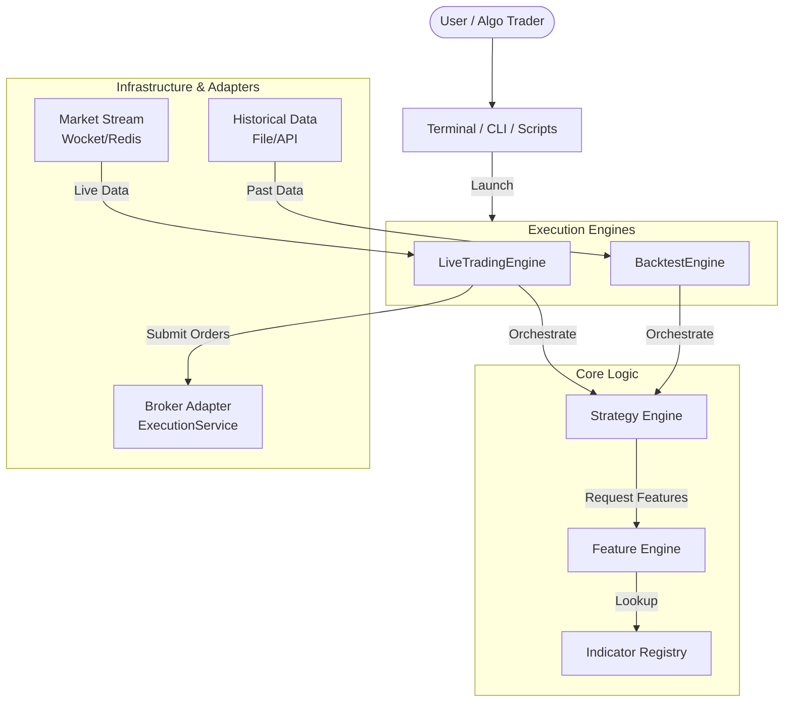
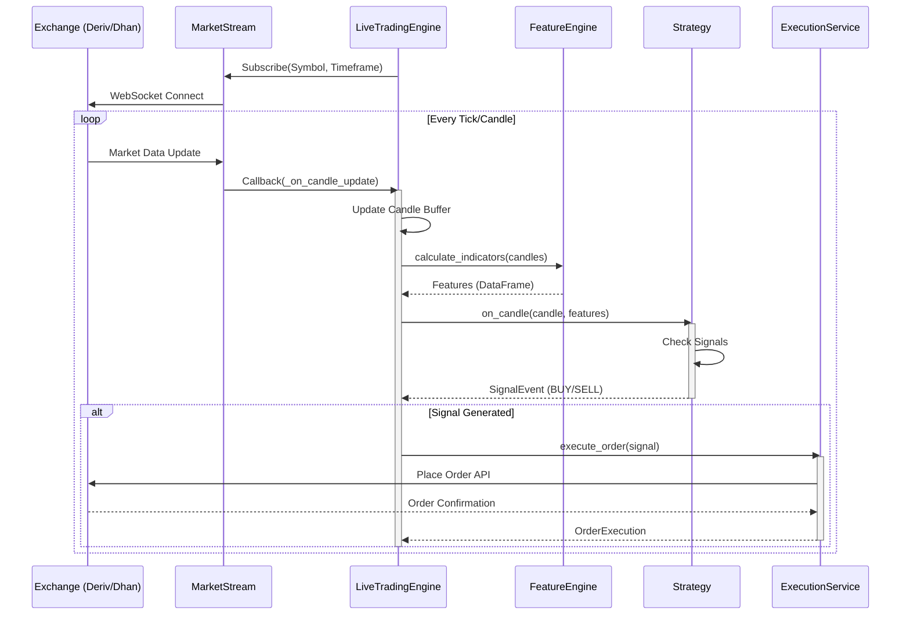
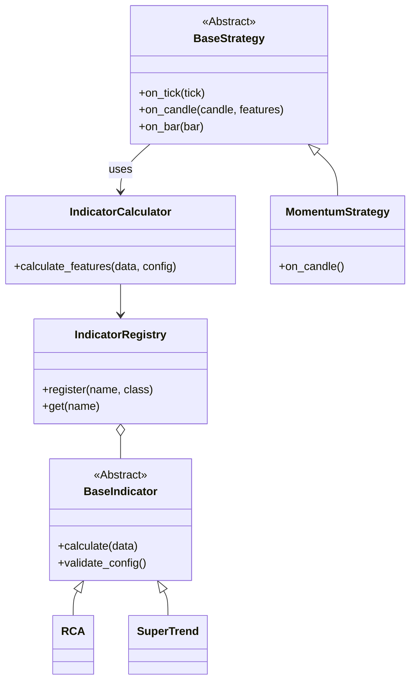
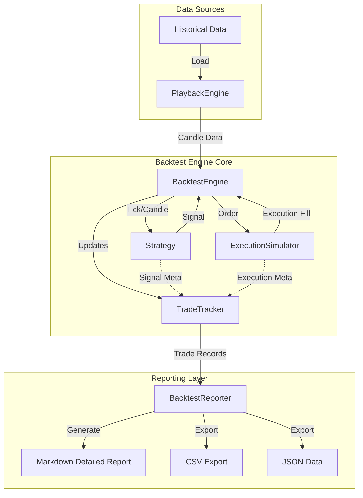
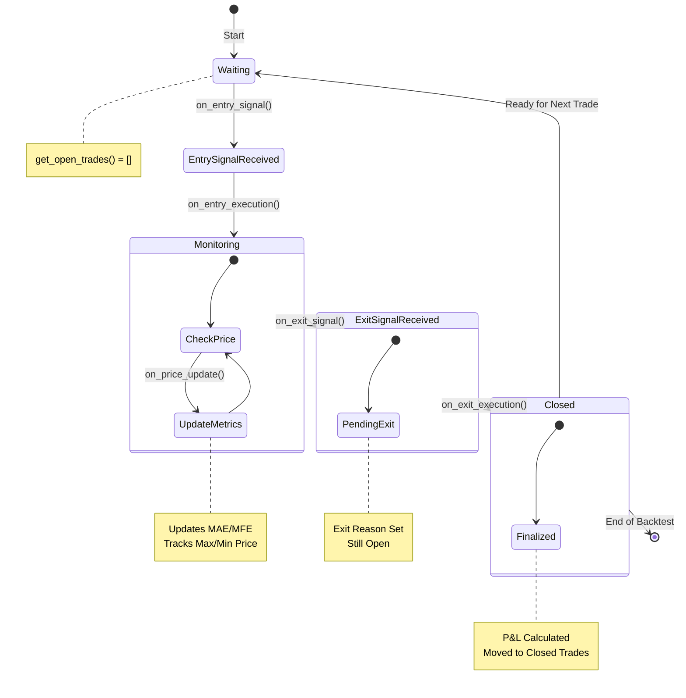

# Trado System Architecture

This document details the architecture of the Trado trading system, covering the high-level design, module interactions, and component-level structures.

## 1. High-Level System Architecture

The Trado system is designed as a modular platform supporting both **Live Trading** and **Backtesting** through a shared core of Strategy and Feature logic.



## 2. Live Trading Data Flow

In Live/Paper trading mode, data flows asynchronously from the exchange via WebSocket, processed by the Feature Engine, and acted upon by the Strategy.



## 3. Component Architecture

### Feature & Strategy Engine
The core logic relies on a Registry pattern for Indicators to ensure extensibility.



---

## 3. Backtesting & Reporting Subsystem

This subsystem handles historical simulation, trade tracking, and detailed performance reporting.



---

## Trade Lifecycle Flow

```
┌──────────────────────────────────────────────────────────────────────────┐
│                         TRADE LIFECYCLE                                   │
└──────────────────────────────────────────────────────────────────────────┘

                    ENTRY PHASE
                    ───────────
                        │
        ┌───────────────┴────────────────┐
        │                                │
    Entry Signal                    on_entry_signal()
    generated by                    ─────────────────
    strategy                        • Create TradeRecord
        │                           • Register with tracker
        │                           • Cache signal metadata
        ▼                           
    SignalEvent              TradeTracker
    • symbol                 • open_trades[trade_id]
    • price                  • intra_metrics[trade_id]
    • confidence
    • indicators
    • candle
        │
        │
        ▼
    Entry Order              on_entry_execution()
    executed by              ──────────────────────
    ExecutionSimulator       • Populate entry_execution
        │                    • Set entry_price, entry_qty
        ▼                    • Record slippage, commission
    OrderExecution           • Initialize MAE/MFE tracker
    • filled_quantity
    • average_fill_price
    • slippage_bps
    • commission


                    MONITORING PHASE
                    ────────────────
                        │
        Every candle    │
        received        │
                        ▼
                    on_price_update()
                    ────────────────
                    • Update intra_metrics
                    • Track max/min prices
                    • Calculate MAE/MFE
                        │
                        │ (repeat each candle)
                        │


                    EXIT PHASE
                    ──────────
                        │
        ┌───────────────┴────────────────────────────────┐
        │                                                 │
    Exit Signal                                     on_exit_signal()
    generated by                                    ─────────────────
    strategy                                        • Link signal to trade
        │                                           • Set exit_reason
        │                                           • Cache exit indicators
        ▼                                   
    SignalEvent                         TradeTracker
    • signal_type (SELL)                (record_exit_reason)
    • reason (e.g., "SL hit")           • exit_reason
    • indicators
        │
        │
        ▼
    Exit Order                          on_exit_execution()
    executed by                         ──────────────────
    ExecutionSimulator                  • Populate exit_execution
        │                               • Calculate P&L
        ▼                               • Calculate MAE/MFE
    OrderExecution                      • Move to closed_trades
    • filled_quantity                   • Clear from open_trades
    • average_fill_price
    • slippage_bps
    • commission
        │
        ▼
    
    ┌─────────────────────────────┐
    │   TradeRecord COMPLETE      │
    │   ─────────────────────     │
    │   • Entry details           │
    │   • Exit details            │
    │   • Execution microstructure│
    │   • P&L calculations        │
    │   • MAE/MFE metrics         │
    │   • Duration tracking       │
    │   • Risk metrics            │
    └─────────────────────────────┘
```

---

## Data Model Relationships

```
┌────────────────────────────────────────────────────────────────┐
│                                                                │
│  ┌─────────────────────┐                                       │
│  │   SignalEvent       │                                       │
│  │ ─────────────────── │                                       │
│  │ • timestamp         │                                       │
│  │ • symbol            │                                       │
│  │ • signal_type       │                                       │
│  │ • confidence        │                                       │
│  │ • reason            │          ┌─────────────────────┐     │
│  │ • indicators   ─────┼─────────▶│   TradeRecord       │     │
│  │ • candle           │          │ ───────────────────  │     │
│  │ • trigger_conds    │          │ • entry_signal      │     │
│  └─────────────────────┘          │ • entry_confidence  │     │
│         ▲                         │ • entry_indicators  │     │
│         │                         │ • exit_signal       │     │
│         │                         │ • exit_reason       │     │
│         │                         │ • exit_indicators   │     │
│  ┌──────┴──────────────┐          └────────┬────────────┘     │
│  │   Strategy          │                   │                  │
│  │ ──────────────────  │                   │                  │
│  │ • on_candle()  ────▶│ Generate signal   │                  │
│  │ • position          │                   │                  │
│  │ • record_exit_reason│ Record exit reason│                  │
│  │ • on_stop_loss()    │                   │                  │
│  └─────────────────────┘                   ▼                  │
│                         ┌─────────────────────────────┐       │
│                         │  OrderExecution (Entry)     │       │
│                         │ ──────────────────────────  │       │
│                         │ • filled_quantity           │       │
│                         │ • average_fill_price  ─────┼──┐    │
│                         │ • slippage_bps              │  │    │
│                         │ • commission                │  │    │
│                         │ • timestamp                 │  │    │
│                         └─────────────────────────────┘  │    │
│                                                          │    │
│                         ┌──────────────────────────────┐ │    │
│                         │  OrderExecution (Exit)       │ │    │
│                         │ ─────────────────────────────  │    │
│                         │ • filled_quantity            │ │    │
│                         │ • average_fill_price   ──────┤─┘    │
│                         │ • slippage_bps               │      │
│                         │ • commission                 │      │
│                         │ • timestamp                  │      │
│                         └──────────────────────────────┘      │
│                                                               │
│  ┌─────────────────────────────────────┐                     │
│  │    IntraTradeMetrics                │                     │
│  │ ───────────────────────────────────  │                     │
│  │ • entry_price        ┐               │                     │
│  │ • max_price          ├─ Track prices │                     │
│  │ • min_price          │ during trade  │                     │
│  │ • get_mae_mfe()      │               │ Linked by trade_id  │
│  └─────────────────────────────────────┘                     │
│                                                               │
│  ┌─────────────────────────────────────┐                     │
│  │    ExitReason (Enum)                │                     │
│  │ ───────────────────────────────────  │                     │
│  │ • STOP_LOSS                         │                     │
│  │ • TAKE_PROFIT                       │ Classifier          │
│  │ • SIGNAL_REVERSAL                   │ for TradeRecord     │
│  │ • MANUAL_EXIT                       │ exit reason         │
│  │ • TIMEOUT                           │                     │
│  │ • LIQUIDATION                       │                     │
│  └─────────────────────────────────────┘                     │
│                                                               │
└────────────────────────────────────────────────────────────────┘
```

---

## TradeTracker State Machine

This state machine manages the lifecycle of a single trade within the `TradeTracker`.



---

## Report Generation Pipeline

```
┌──────────────────────────────────────────────────────────────┐
│           Trade Data → Report Generation                     │
└──────────────────────────────────────────────────────────────┘

    List[TradeRecord]
            │
            ├─────────────────┬──────────────────┬──────────────┐
            │                 │                  │              │
            ▼                 ▼                  ▼              ▼
    
    ┌──────────────┐  ┌──────────────┐  ┌──────────────────┐
    │  CSV Export  │  │ JSON Export  │  │ Markdown Report  │
    └──────┬───────┘  └──────┬───────┘  └────────┬─────────┘
           │                 │                   │
           │ to_csv_row()    │ to_dict()        │ Formatted
           │ for each trade  │ for each trade   │ with sections
           │                 │                  │
           ▼                 ▼                  ▼
    
    CSV File            JSON File          MD File
    ────────            ────────           ───────
    • Header row        • Metadata         • Title
    • One row per trade • Array of trades  • Summary section
    • Flattened data    • Full structure   • Per-trade table
                        • Nested objects   • Execution analysis
                        • Signal details   • Risk analysis
                        • Execution data   • Trade groupings
                                          • Statistics
                                          • Detailed records


    ┌─────────────────────────────────────────┐
    │     Report Content Structure             │
    └─────────────────────────────────────────┘
    
    1. Summary Statistics
       • Total trades, win rate, profit factor
       • Average P&L metrics
       • Duration stats
       • Slippage costs
    
    2. Per-Trade Analysis Table
       • Trade #, symbol, times, prices, quantities
       • P&L and percentages
       • Exit reason
       • MAE/MFE percentages
    
    3. Execution Quality Analysis
       • Entry slippage distribution
       • Exit slippage distribution
       • Cost impact analysis
    
    4. Risk Analysis
       • MAE/MFE statistics
       • Exit reason distribution
       • Win rate by exit reason
    
    5. Trade Groupings
       • By symbol
       • By duration ranges
       • By exit reason
    
    6. Statistical Analysis
       • Mean, median, std dev
       • Skewness, kurtosis
       • Distribution percentiles
    
    7. Detailed Trade Records (if ≤ 50 trades)
       • Full breakdown per trade
       • All metrics and details
```

---

## Integration Points with Existing Code

```
┌─────────────────────────────────────────────────────────────┐
│                    Existing Components                       │
└─────────────────────────────────────────────────────────────┘

    BacktestEngine (backtester/backtest_engine.py)
    │
    ├─ _handle_signal(signal)
    │  ├─ Create entry order
    │  └─ NEW: tracker.on_entry_signal()
    │         tracker.on_entry_execution()
    │
    ├─ _on_candle(candle)
    │  ├─ Process market data
    │  └─ NEW: tracker.on_price_update()  [For open positions]
    │
    └─ ... other methods


    BaseStrategy (strategy_engine/base_strategy.py)
    │
    ├─ position: Position
    │  └─ NEW: exit_reason field
    │
    ├─ check_risk_management()
    │  └─ NEW: Call on_stop_loss_hit() / on_take_profit_hit()
    │
    ├─ NEW: on_stop_loss_hit()
    ├─ NEW: on_take_profit_hit()
    ├─ NEW: on_signal_reversal()
    ├─ NEW: on_manual_exit()
    ├─ NEW: on_timeout()
    ├─ NEW: on_liquidation()
    │
    └─ NEW: record_exit_reason()


    ExecutionSimulator (backtester/execution_simulator.py)
    │
    ├─ simulate_order()  ← Returns OrderExecution
    │  └─ No changes needed [OrderExecution already has all details]
    │
    └─ ... other methods


    BacktestReporter (backtester/reporter.py)
    │
    ├─ generate_report()  [Existing]
    │
    ├─ NEW: generate_detailed_trades_report()
    ├─ NEW: export_trades_to_csv()
    ├─ NEW: export_trades_to_json()
    │
    └─ ... other helper methods
```

---

## Data Flow Example: Single Trade

```
Time 09:30 - Entry Signal
────────────────────────
    Strategy detects bullish pattern
            │
            ▼
    strategy.on_candle() returns SignalEvent
    • signal_type = "BUY"
    • confidence = 0.85
    • indicators = {RSI: 75, MACD: 0.5, ...}
    • candle = {open: 210.00, high: 211.50, ...}
            │
            ▼
    BacktestEngine._handle_signal(signal)
            │
            ├─ trade_id = tracker.on_entry_signal(signal)
            │  → TradeRecord created
            │  → open_trades["TRADE-..."] = record
            │  → intra_metrics["TRADE-..."] = IntraTradeMetrics(210.50)
            │
            ├─ execution = execution_simulator.simulate_order(...)
            │  → OrderExecution with actual fill
            │     • average_fill_price = 210.52 (slipped 2 bps)
            │     • filled_quantity = 47.52 shares
            │     • slippage_bps = 2.0
            │     • commission = 5.00
            │
            └─ tracker.on_entry_execution(trade_id, execution)
               → TradeRecord.entry_price = 210.52
               → TradeRecord.entry_slippage_bps = 2.0
               → TradeRecord.entry_commission = 5.00


Time 09:45 - 10:30 - Price Updates
────────────────────────────────────
    Each candle:
            │
            ├─ Candle.close = 211.20 (09:45)
            │  └─ tracker.on_price_update(trade_id, 211.20)
            │     → intra_metrics.update(211.20)
            │     → max_price = 211.20
            │     → min_price = 210.52
            │
            ├─ Candle.close = 210.80 (10:00)
            │  └─ tracker.on_price_update(trade_id, 210.80)
            │     → max_price = 211.20 (unchanged)
            │     → min_price = 210.52 (unchanged)
            │
            ├─ Candle.close = 212.10 (10:15)
            │  └─ tracker.on_price_update(trade_id, 212.10)
            │     → max_price = 212.10 (updated!)
            │
            └─ Candle.close = 211.75 (10:30)
               └─ tracker.on_price_update(trade_id, 211.75)
                  → max_price = 212.10 (unchanged)
                  → min_price = 210.52 (unchanged)


Time 11:15 - Exit Signal
────────────────────────
    Strategy detects signal reversal
            │
            ▼
    strategy.on_candle() returns SignalEvent
    • signal_type = "SELL"
    • reason = "RSI < 50, bearish divergence"
    • indicators = {RSI: 48, MACD: -0.2, ...}
            │
            ▼
    BacktestEngine._handle_signal(signal)
            │
            ├─ tracker.on_exit_signal(signal, trade_id)
            │  → TradeRecord.exit_signal = signal
            │  → TradeRecord.exit_reason_text = "..."
            │
            ├─ strategy.on_signal_reversal(211.75, "SELL")
            │  → Custom logic (if overridden)
            │
            ├─ execution = execution_simulator.simulate_order(...)
            │  → OrderExecution with exit fill
            │     • average_fill_price = 211.73 (slipped -2 bps)
            │     • filled_quantity = 47.52
            │     • slippage_bps = 2.0
            │     • commission = 5.00
            │
            └─ tracker.on_exit_execution(trade_id, execution, ExitReason.SIGNAL_REVERSAL)
               → TradeRecord.exit_price = 211.73
               → TradeRecord.exit_slippage_bps = 2.0
               → TradeRecord.exit_reason = ExitReason.SIGNAL_REVERSAL
               
               → CALCULATIONS:
                  • gross_pnl = (211.73 - 210.52) × 47.52 = $57.48
                  • total_costs = (2.0 + 2.0 + 5.0 + 5.0) = $14.00
                  • net_pnl = $57.48 - $14.00 = $43.48
                  • pnl_pct = ($43.48 / (210.52 × 47.52)) = 0.0436% = 4.36%
                  
                  • duration = 11:15 - 09:30 = 1h 45m = 6300 seconds
                  • MAE = (210.52 - 210.52) / 210.52 = 0% (no adverse movement)
                  • MFE = (212.10 - 210.52) / 210.52 = 0.75%
               
               → TradeRecord moved to closed_trades
               → TradeRecord removed from open_trades


Post-Backtest - Report Generation
──────────────────────────────────
    trades = tracker.get_all_trades()
    → Returns List[TradeRecord] with all closed trades
    
    reporter.generate_detailed_trades_report(trades, "MomentumStrategy")
    → Generates markdown with this trade in the tables
    
    Example table row:
    | 1 | AAPL | 2024-12-15 09:30 | 2024-12-15 11:15 | 1h 45m | 
      $210.52 | $211.73 | 47.52 | $43.48 | 4.36% | signal_reversal | 0.00% | 0.75% |
```

---

This architecture provides complete trade lifecycle tracking with detailed signal context, execution microstructure, and risk metrics for comprehensive backtest analysis.
